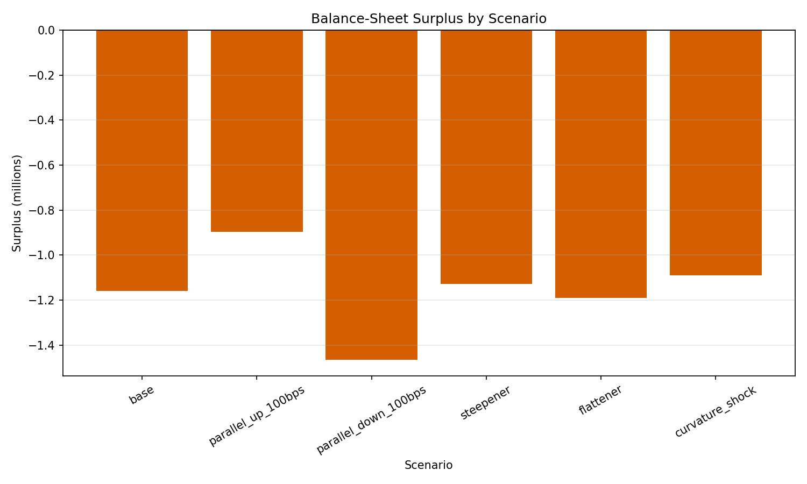
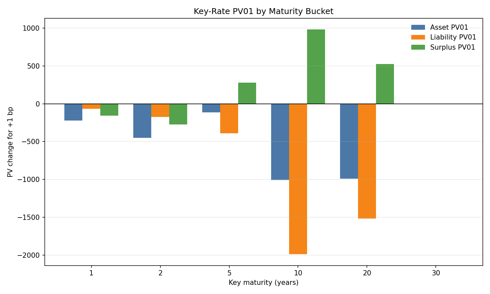

# yield-curve-alm-engine

A fixed-income ALM analytics engine that transforms public ECB yield curves and
local cash-flow inputs into bond valuation, liability present value, duration,
convexity, key-rate PV01, surplus stress testing, curve-shape diagnostics and
reproducible Markdown reports.

ECB curve data is fetched once into normalized local CSV files. All valuation,
stress testing, plotting and reporting scripts then run offline from local
inputs. Synthetic curve, asset and liability examples remain available as
fallback/demo fixtures, but the intended workflow is:

```text
ECB/public yield curve + local asset/liability cash-flow inputs
-> zero-curve analytics
-> valuation
-> duration / convexity
-> key-rate PV01
-> surplus stress testing
-> forward/slope/curvature diagnostics
-> professional Markdown report and figures
```

The project is a research/portfolio-grade prototype for fixed-income ALM and
curve-risk analytics. It is not an EIOPA-style regulatory implementation, a
trading system, a production valuation platform or a market data system.

See [docs/sample_alm_report.md](docs/sample_alm_report.md) for a
recruiter-readable example output.

## Recruiter Quick View

- Field: fixed-income ALM / curve risk / actuarial finance.
- Data workflow: ECB/public curve fetch -> normalized CSV -> offline ALM analytics.
- Core modelling: zero-curve discounting, fixed-rate bond cash flows, liability PV, duration, convexity, key-rate PV01, surplus stress testing.
- Quant diagnostics: forward rates, 2Y-10Y slope, 2Y-5Y-10Y curvature, local curve shocks.
- Engineering: Python package, installable CLI, pytest suite, GitHub Actions, reproducible CSV/Markdown outputs.
- Scope: professional-style research engine; not a production regulatory model.

## What Public Yield Curves Provide vs What This Engine Adds

| Layer | Public yield-curve dashboard | This engine |
|---|---:|---:|
| Yield curve observations | yes | fetches and normalizes |
| Reproducible local curve CSV | no | yes |
| Discount factors | derived | yes |
| Forward rates | no / limited | yes |
| Bond cash-flow valuation | no | yes |
| Liability present value | no | yes |
| Asset-liability surplus | no | yes |
| Duration and convexity | no | yes |
| Key-rate PV01 | no | yes |
| Curve slope / curvature diagnostics | no | yes |
| Stress scenarios | no | yes |
| Markdown ALM report | no | yes |

## Motivation

ALM connects market curves, asset cash flows, liability cash flows and
balance-sheet surplus. This project keeps that setup transparent so the
calculations can be read, tested and extended without hiding behind external
data feeds or heavy frameworks.

The current implementation can:

- fetch public ECB euro area spot yield curves into reproducible local CSVs;
- load local zero-curve, bond portfolio and liability cash-flow CSV files;
- compute discount factors and continuous forward-rate diagnostics;
- price a stylized portfolio of fixed-rate bullet bonds;
- value liability cash-flow profiles;
- compute present value, duration and convexity metrics;
- compute key-rate PV01 and duration diagnostics;
- compare asset and liability cash-flow timing gaps;
- revalue assets and liabilities under deterministic rate shocks;
- compare balance-sheet surplus across scenarios;
- produce compact ALM dashboard and Markdown report exports;
- export simple CSV reports and matplotlib charts.

## CV / Portfolio Highlights

- `src/` layout with editable installation through `pyproject.toml`.
- Unit tests and a lightweight GitHub Actions test workflow.
- Clear separation between curves, instruments, risk analytics and scripts.
- Reproducible synthetic examples with optional CSV inputs and public ECB curve ingestion.
- ALM diagnostics covering surplus, duration gap, key-rate PV01 and cash-flow matching.
- Installable command-line entry points plus `python -m` alternatives.
- Explicit documentation of assumptions, data provenance and limitations.

See [docs/methodology.md](docs/methodology.md) for the modelling conventions and
[docs/data_sources.md](docs/data_sources.md) for the public data-source workflow.
See [docs/reporting_workflow.md](docs/reporting_workflow.md) for the report and
figures workflow.

## Repository Structure

```text
.
├── .github/
│   └── workflows/
│       └── tests.yml
├── LICENSE
├── README.md
├── docs/
│   ├── data_sources.md
│   ├── figures/
│   │   ├── cashflow_gap.png
│   │   ├── curve_scenarios.png
│   │   ├── key_rate_pv01.png
│   │   └── surplus_by_scenario.png
│   ├── methodology.md
│   ├── reporting_workflow.md
│   └── sample_alm_report.md
├── pyproject.toml
├── requirements.txt
├── .gitignore
├── data/
│   └── examples/
│       ├── example_bond_portfolio.csv
│       ├── example_zero_curve.csv
│       ├── liabilities/
│       │   └── example_liability_cashflows.csv
│       └── portfolios/
│           └── example_bond_portfolio.csv
├── outputs/
│   └── .gitkeep
└── src/
    └── yield_curve_alm_engine
        ├── __init__.py
        ├── config.py
        ├── data
        │   ├── __init__.py
        │   └── ecb.py
        ├── loaders.py
        ├── curve
        │   ├── __init__.py
        │   ├── analytics.py
        │   ├── base_curve.py
        │   └── shocks.py
        ├── instruments
        │   ├── __init__.py
        │   ├── bonds.py
        │   └── liabilities.py
        ├── risk
        │   ├── __init__.py
        │   ├── cashflow_matching.py
        │   ├── curve_analytics.py
        │   ├── duration_convexity.py
        │   ├── immunization.py
        │   ├── key_rate.py
        │   └── surplus.py
        └── scripts
            ├── common.py
            ├── __init__.py
            ├── build_alm_dashboard.py
            ├── build_base_case.py
            ├── fetch_ecb_curve.py
            ├── generate_report.py
            ├── run_stress_tests.py
            └── plot_results.py
└── tests/
    ├── test_alm_dashboard.py
    ├── test_cli_parsing.py
    ├── test_bonds.py
    ├── test_cashflow_matching.py
    ├── test_curve.py
    ├── test_curve_analytics.py
    ├── test_ecb_parser.py
    ├── test_generate_report.py
    ├── test_immunization.py
    ├── test_key_rate.py
    ├── test_loaders.py
    ├── test_plot_results.py
    └── test_surplus.py
```

## Data Provenance

The preferred curve workflow uses public ECB euro area spot yield curves fetched
into normalized local CSV files. Valuation scripts do not call the ECB API
directly; they consume local files through `--curve-csv`.

Synthetic fallback data remains available for demos and tests:

- zero curve: hard-coded maturities and zero rates in
  `src/yield_curve_alm_engine/curve/base_curve.py`;
- bond portfolio: hard-coded fixed-rate bond examples in
  `src/yield_curve_alm_engine/instruments/bonds.py`;
- liabilities: synthetic annual cash flows generated in
  `src/yield_curve_alm_engine/instruments/liabilities.py`.

There is no Bloomberg, FRED, broker, accounting system or actuarial data
ingestion. The project is not an EIOPA regulatory ALM implementation and does
not provide a market data management stack.

The project can also read user-supplied CSV files for the zero curve, bond
portfolio and liability cash flows. Those files are treated as external
scenario inputs, not automatically validated market or actuarial data.

## Financial Methodology

### Zero Curve

The base curve is a synthetic zero-coupon curve with maturities from 0.5 to 30
years. Rates are continuously compounded and interpolated linearly:

```text
DF(t) = exp(-r(t) * t)
```

Flat extrapolation is used outside the quoted maturity range.

Curve analytics include discount factors, continuous forward rates, 2Y-10Y
slope, 5Y-30Y slope and 2Y-5Y-10Y curvature.

### Bond Pricing

Bonds are stylized fixed-rate bullet instruments. Each bond generates coupon
and principal cash flows, and the price is the sum of discounted future cash
flows. The model is accrued-free and assumes valuation just after an issue or
coupon date.

### Liabilities

Liabilities are represented as annual positive cash outflows over 20 years. The
default schedule is synthetic and hump-shaped to make duration and surplus
sensitivity meaningful without pretending to use market or actuarial data.

### Duration and Convexity

The risk module computes Macaulay duration, modified duration and convexity from
generic dated cash flows. Under continuous compounding, modified duration equals
Macaulay duration for a parallel shift in zero rates.

### Duration Gap Diagnostic

The base-case summary includes a simple first-order duration-gap diagnostic. It
approximates the surplus impact of a 1 bp parallel rate increase using asset and
liability modified durations. This is a reading aid for ALM intuition, not a
hedging recommendation.

### Surplus

The core ALM metric is:

```text
surplus = asset market value - liability present value
```

Asset market value is the sum of bond prices. Liability present value is the
discounted value of future liability cash flows.

### Stress Tests

The project includes deterministic yield-curve scenarios:

- `parallel_up_100bps`
- `parallel_down_100bps`
- `steepener`
- `flattener`
- `curvature_shock`

Each stress returns a new curve object, then assets, liabilities and surplus are
revalued consistently.

## How To Run

From the repository root:

```bash
python3 -m venv .venv
.venv/bin/python -m pip install -e ".[dev]"
.venv/bin/python -m pytest
.venv/bin/python -m yield_curve_alm_engine.scripts.build_base_case
.venv/bin/python -m yield_curve_alm_engine.scripts.run_stress_tests
.venv/bin/python -m yield_curve_alm_engine.scripts.build_alm_dashboard
.venv/bin/python -m yield_curve_alm_engine.scripts.plot_results
.venv/bin/python -m yield_curve_alm_engine.scripts.generate_report
```

The `requirements.txt` file is retained as a minimal runtime dependency list,
but editable installation through `pyproject.toml` is the preferred development
workflow.

## Quality Checks

```bash
python -m pytest
python -m compileall src
```

After editable installation, these console commands are also available:

```bash
yield-curve-build-base --help
yield-curve-run-stress --help
yield-curve-build-dashboard --help
yield-curve-plot-results --help
yield-curve-fetch-ecb --help
yield-curve-generate-report --help
```

The module form remains supported for users who prefer not to rely on installed
commands:

```bash
python -m yield_curve_alm_engine.scripts.build_base_case
python -m yield_curve_alm_engine.scripts.run_stress_tests
python -m yield_curve_alm_engine.scripts.build_alm_dashboard
python -m yield_curve_alm_engine.scripts.plot_results
python -m yield_curve_alm_engine.scripts.fetch_ecb_curve --help
python -m yield_curve_alm_engine.scripts.generate_report
```

## Using ECB Yield Curve Data

The preferred public-curve workflow is to refresh the ECB curve into a local
CSV, then run the ALM scripts against that saved file.

```bash
yield-curve-fetch-ecb \
  --curve-type aaa \
  --date latest \
  --output data/market_curves/ecb/ecb_aaa_spot_latest.csv

yield-curve-build-base \
  --curve-csv data/market_curves/ecb/ecb_aaa_spot_latest.csv \
  --bonds-csv data/examples/portfolios/example_bond_portfolio.csv \
  --liabilities-csv data/examples/liabilities/example_liability_cashflows.csv
```

Supported curve types are:

| `--curve-type` | ECB issuer universe | Curve name |
| --- | --- | --- |
| `aaa` | AAA-rated euro area central government bonds | `ecb_aaa_spot` |
| `all` | all euro area central government bond ratings | `ecb_all_spot` |

ECB observations are percent per annum and are converted to decimal zero rates
in the normalized CSV. Internet access is only required when refreshing the ECB
CSV. Once fetched, the ALM engine runs from local files.

See [docs/data_sources.md](docs/data_sources.md) for details and limitations.

## User CSV Inputs

The scripts can use the built-in synthetic inputs or user-provided CSV files.
Example files are provided in `data/examples/`.

```bash
yield-curve-build-base \
  --curve-csv data/examples/example_zero_curve.csv \
  --bonds-csv data/examples/portfolios/example_bond_portfolio.csv \
  --liabilities-csv data/examples/liabilities/example_liability_cashflows.csv

yield-curve-run-stress \
  --curve-csv data/examples/example_zero_curve.csv \
  --bonds-csv data/examples/portfolios/example_bond_portfolio.csv \
  --liabilities-csv data/examples/liabilities/example_liability_cashflows.csv

yield-curve-build-dashboard \
  --curve-csv data/examples/example_zero_curve.csv \
  --bonds-csv data/examples/portfolios/example_bond_portfolio.csv \
  --liabilities-csv data/examples/liabilities/example_liability_cashflows.csv

yield-curve-plot-results \
  --curve-csv data/examples/example_zero_curve.csv \
  --bonds-csv data/examples/portfolios/example_bond_portfolio.csv \
  --liabilities-csv data/examples/liabilities/example_liability_cashflows.csv \
  --publish-docs-figures

yield-curve-generate-report \
  --curve-csv data/examples/example_zero_curve.csv \
  --bonds-csv data/examples/portfolios/example_bond_portfolio.csv \
  --liabilities-csv data/examples/liabilities/example_liability_cashflows.csv
```

The equivalent `python -m yield_curve_alm_engine.scripts.<script_name>` form can
be used for every command above.

Expected zero-curve CSV columns:

| column | description |
| --- | --- |
| `maturity_years` | maturity in years, strictly positive |
| `zero_rate` | continuously compounded annual zero rate in decimal form |

Expected bond portfolio CSV columns:

| column | description |
| --- | --- |
| `name` | bond label |
| `face_value` | notional principal |
| `coupon_rate` | annual coupon rate in decimal form |
| `maturity_years` | maturity in years |
| `coupon_frequency` | integer number of coupon payments per year |

Expected liability CSV columns:

| column | description |
| --- | --- |
| `time_years` | future cash-flow time in years, strictly positive |
| `cash_flow` | positive liability outflow |

The CSV loader performs basic schema and numeric validation. It does not add
market conventions such as day count, calendars, settlement dates or accrued
interest.

## Example Outputs

The scripts generate CSV and PNG artifacts in `outputs/`:

- `alm_dashboard_summary.csv`
- `alm_dashboard.md`
- `alm_report.md`
- `base_case_curve_analytics.csv`
- `base_curve.csv`
- `base_case_bonds.csv`
- `base_case_liabilities.csv`
- `base_case_summary.csv`
- `base_case_shock_comparison.csv`
- `stress_test_results.csv`
- `bond_sensitivities.csv`
- `key_rate_report.csv`
- `cashflow_gap_report.csv`
- `report_curve_analytics.csv`
- `report_shock_comparison.csv`
- `curve_scenarios.png`
- `surplus_by_scenario.png`
- `asset_liability_by_scenario.png`
- `key_rate_pv01.png`
- `cashflow_gap.png`

## Sample Outputs

The repository includes curated sample outputs generated from the local example
CSV workflow:

- [docs/sample_alm_report.md](docs/sample_alm_report.md)
- [docs/figures/curve_scenarios.png](docs/figures/curve_scenarios.png)
- [docs/figures/surplus_by_scenario.png](docs/figures/surplus_by_scenario.png)
- [docs/figures/key_rate_pv01.png](docs/figures/key_rate_pv01.png)
- [docs/figures/cashflow_gap.png](docs/figures/cashflow_gap.png)





## Limitations

This is a professional-style research prototype. It deliberately omits:

- bootstrapping from traded instruments;
- full market data management and production data quality controls;
- credit spreads and default risk;
- inflation-linked or stochastic liabilities;
- taxes, expenses, liquidity constraints and capital requirements;
- full day count conventions, calendars and accrued interest;
- stochastic interest-rate models.

The goal is conceptual clarity, reproducible examples and readable engineering.
The project should not be used for trading, reporting, regulatory submissions or
real balance-sheet decisions.

## Future Extensions

Good next steps include:

- add richer source metadata in generated dashboard reports;
- compare built-in and user-input portfolios in one report;
- support additional liability shapes and scenario sets;
- broaden tests around script entry points and invalid CSV cases;
- add optional stochastic-rate examples while preserving the deterministic workflow.
